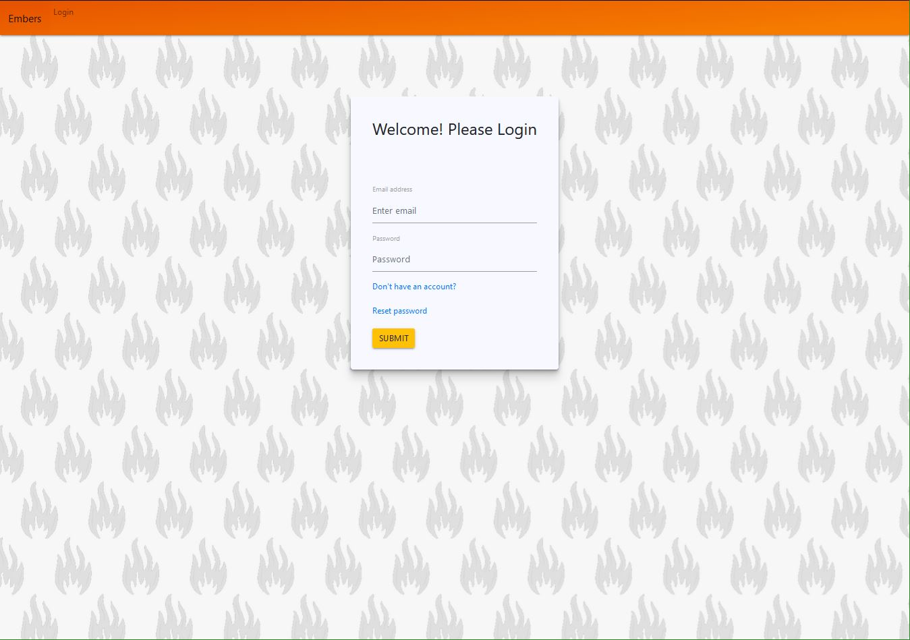
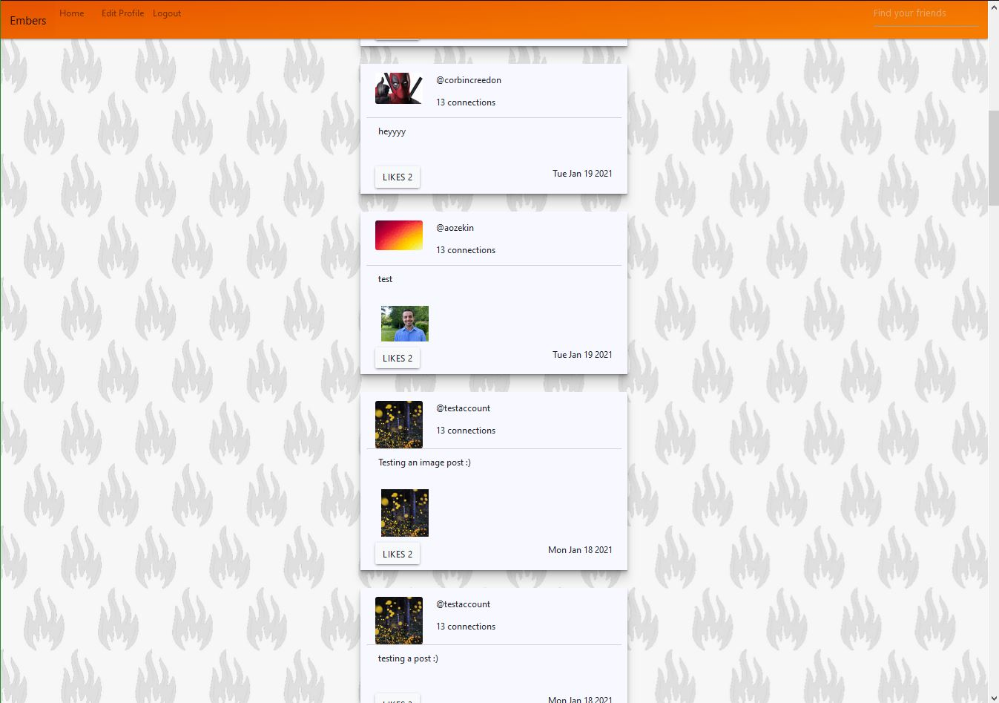
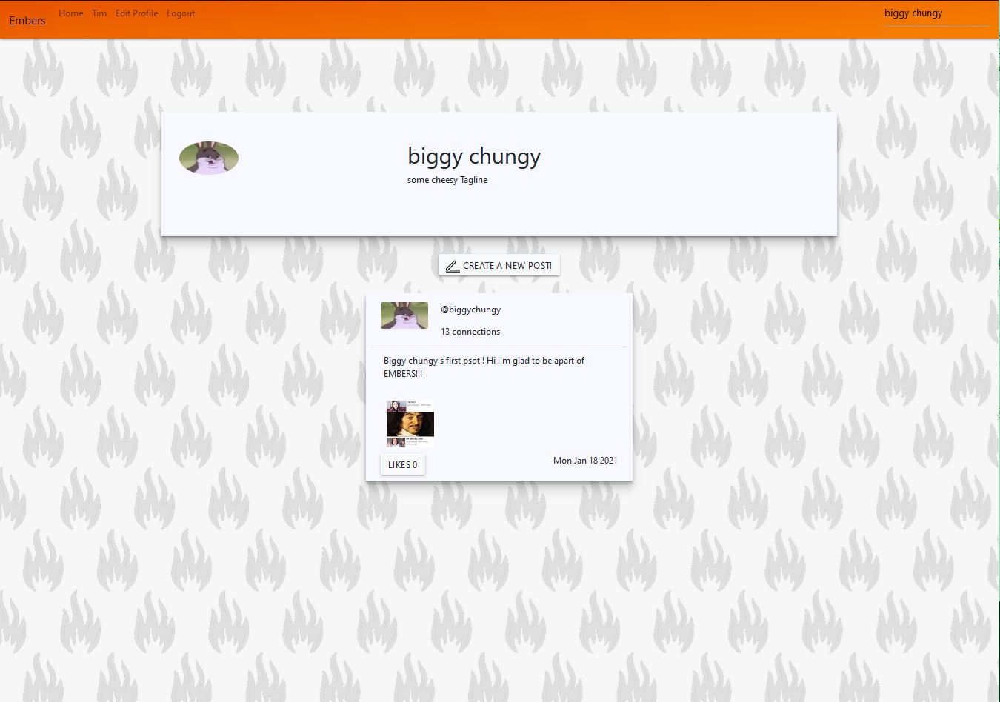
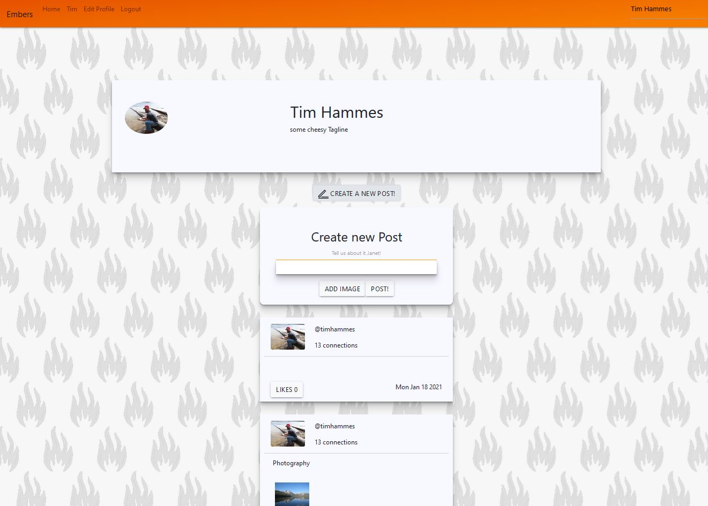
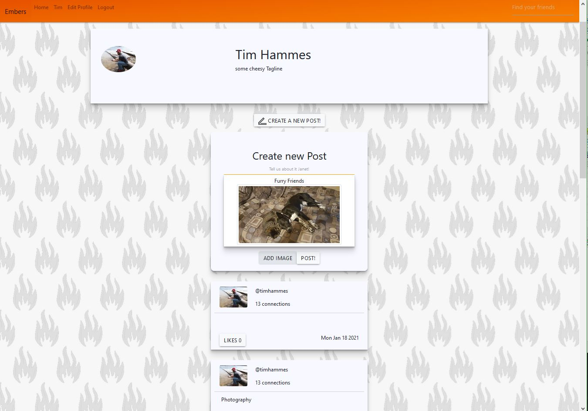
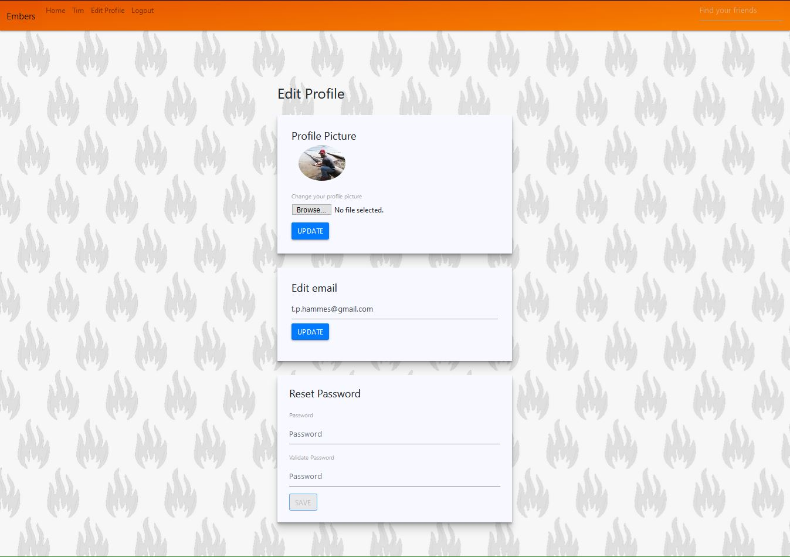
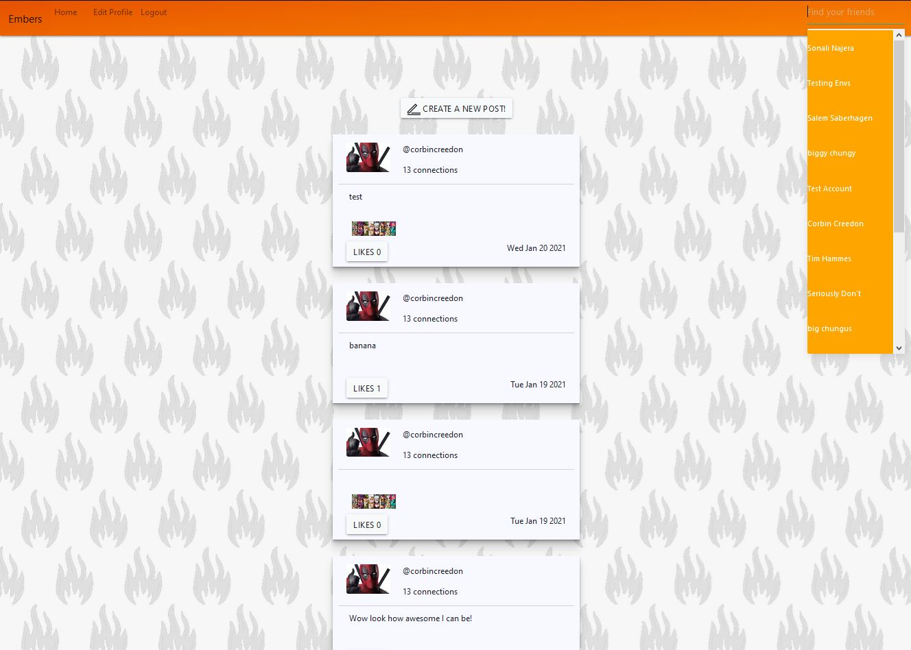
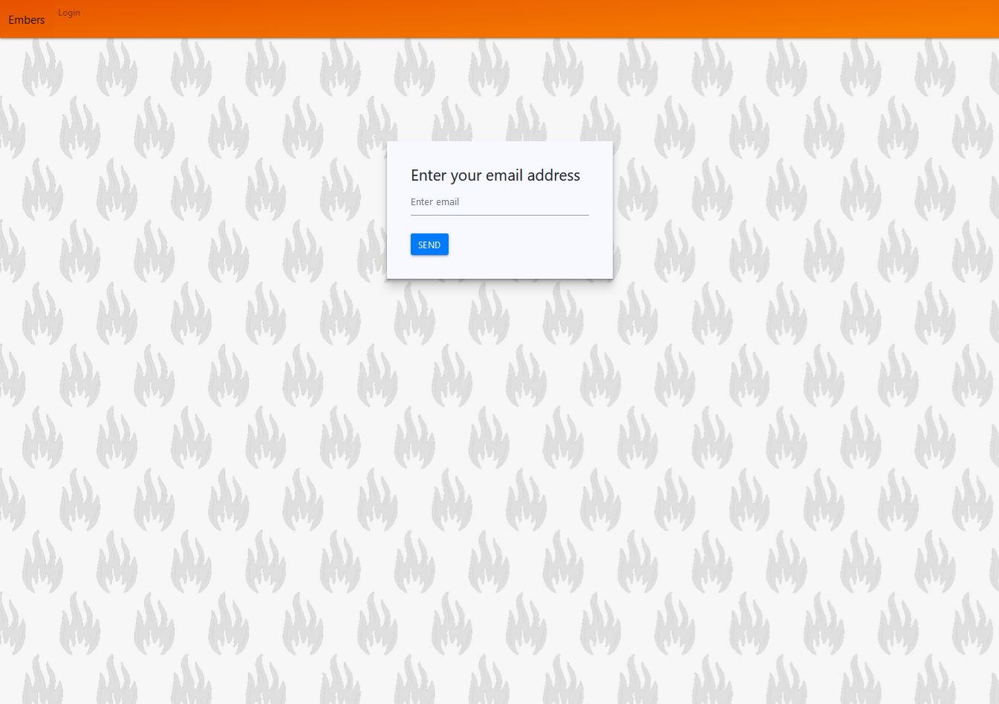
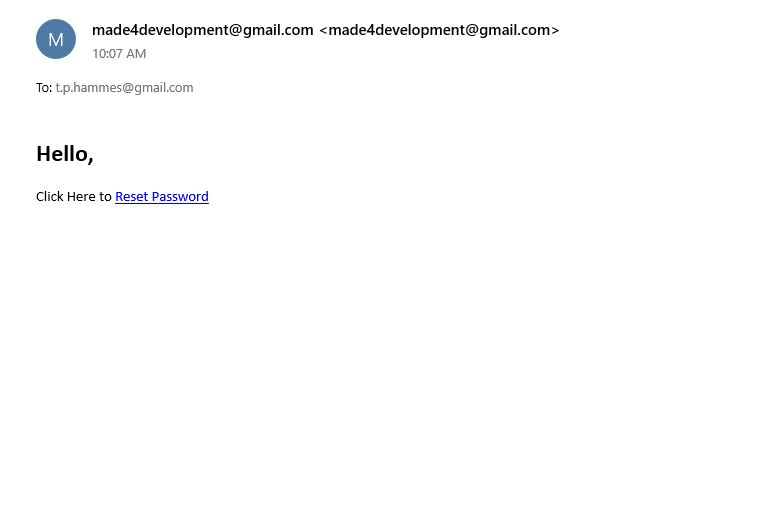

# EMBERS-APP

Embers is a social media web application built using Spring Framework and React where friends can connect and share stories, insights, and more.
 
## Technologies
 
* Java version 1.8
* Maven version 1.8
* Spring Core version 5.2.12
* Spring ORM version 5.2.12
* Spring MVC version 5.2.12
* Jackson core version 2.11.3
* JUnit version 4.13
* Log4j version 1.2.17
* PostgreSQL version 4.2.18
* Apache Tomcat version 9.0.41
* AWS Java SDK version 1.9.2
* AWS Java SDK S3 version 1.11.371
* Apache Spark version 2.4.4

## Features

* Users can register and create new profile
* Users can create new posts
* Users can add images to their posts
* Users can like posts created by other users
* Users can update their profile information (picture, email, password)
* Users can have a link sent to their email that allows them to reset their password
* Users can search for and view other user profiles

## Getting Started 
* Clone repo to a local directory by navigating inside of that directory from command line and run the command below
* `git clone` git@github.com:TimHammes/EMBERS-APP.git
## Back End Set Up
* Open Eclipse IDE and select Import from File menu to add project to workspace
* Type Maven into search bar and select Existing Maven project 
* Browse to Project Directory and click Finish
* [Download Tomcat 9 Here](https://tomcat.apache.org/tomcat-9.0-doc/setup.html) to local directory
* Add Tomcat to Eclipse workspace: Window--preferences--Server--Runtime Environment--Add--Apache--Tomcat version 9
* Set port: In package explorer find Tomcat server inside Server folder and open Server.xml to change port(if needed)
* Add Tomcat to project build path: Right click project and select properties--targeted runtimes--Apache Tomcat
* Open Server view: Window--Other--Server
* Add project to Tomcat: Right click Tomcat in server view and select 'Add and Remove'. Select project and Add
* Start up Tomcat Server: Right click Tomcat in server view and select Start
* Launch project: Right click project in package explorer and select Run As--Run on Server
## Front End Set Up
* [Download and Install Node.Js](https://nodejs.org/en/download/)
* Open Command Line Terminal and navigate to React project directory
* Inside of React project directory run the command `npm install` to download and install project dependencies
* Launch application by running the command `npm start`

## Usage

## Contributors
Cody Moody, Orkun Ozekin, Sonali Najera, Tim Hammes, and Corbin Creedon

## License
This project uses the following license: [GNU General Public License](LICENSE)
